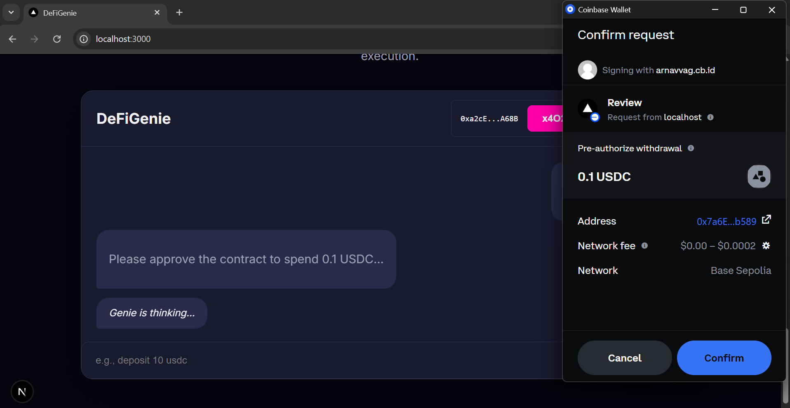

# DeFiGenie: An AI Agent for Effortless DeFi 🧞‍♂️

**DeFiGenie** is an intuitive AI assistant built on the **Base blockchain** that empowers users to invest, optimize yields, and monitor assets using simple English commands. It aims to democratize DeFi by bridging the gap between complex protocols and user-friendliness, making decentralized finance **accessible, intelligent, and secure** for everyone.

---

## ✨ Key Features
- **Conversational AI Assistant** – Interact with DeFi using plain English, powered by **Google Gemini AI**.  
- **Real Wallet Integration** – Connect your **Coinbase Wallet** to check balances and perform transactions directly from chat.  
- **Gas-less USDC Transactions** – Paymaster API integration removes the need for ETH for certain USDC actions.  
- **x402 Micropayments** – Seamless micropayments for premium AI features via the **x402 protocol**.  
- **Modern Multi-Section UI** – Built with **Next.js** to guide users through DeFi concepts and features.

---

## 📸 Screenshots

_The DeFiGenie Landing Page_


_The DeFiGenie Impact_


_The Conversational Assistant in Action_


---

## 🛠️ Tech Stack
**Frontend:** Next.js (React), CSS Modules, Ethers.js, Coinbase Wallet SDK, x402-axios  
**Backend:** Node.js, Express.js, Google Gemini AI, x402-express  
**Blockchain:** Solidity, Hardhat, Base Sepolia Testnet  

---

## 📈 Impact & Business Vision
- Maximize returns by **up to 25%**  
- Reduce manual effort by **90%+**  
- Save **70%+** time on portfolio management  
- Subscription model: **$10-50 ARPU**, projected **500k users** in 3 years → **$5–25M ARR**  
- x402 protocol enables **pay-per-request monetization** for advanced insights and automation.  

---

## ⚙️ Getting Started (Local Setup)

### Prerequisites
- Node.js (v18+)  
- `pnpm` package manager (`npm install -g pnpm`)  
- Coinbase Wallet browser extension  
- Base Sepolia testnet wallet with **ETH** (for deployment) and **USDC**  
- Google AI API key & Coinbase Build RPC URL  

---

### Installation
```bash
git clone <your-repo-url>
cd DeFiGenie
```

**Contracts**
```bash
cd packages/contracts
npm install
```

**Backend**
```bash
cd ../backend
npm install
```
Create a `.env` in `packages/backend/`:
```env
GOOGLE_API_KEY="your_google_api_key"
AGENT_PRIVATE_KEY="a_private_key_from_hardhat_funded_with_usdc"
PAY_TO_ADDRESS="your_personal_wallet_public_address"
```

**Frontend**
```bash
cd ../frontend
npm install
```

---

### Running the Project
Use **four terminals**:

1. **Start Local Blockchain**  
```bash
# In packages/contracts
npx hardhat node
```

2. **Deploy Contract**  
```bash
# In packages/contracts
npx hardhat run scripts/deploy.js --network localhost
```
Copy the deployed address.

3. **Start Backend**  
```bash
# In packages/backend
node index.js
```

4. **Start Frontend**  
Set `DEFIGENIE_CONTRACT_ADDRESS` in `packages/frontend/app/page.tsx` or `.env.local`.  
```bash
# In packages/frontend
npm run dev
```

Visit: **http://localhost:3000**

---

## 👥 Team
- Aryan Singh  
- Arnavv Agnihotri  
- Kavyansh Jain
